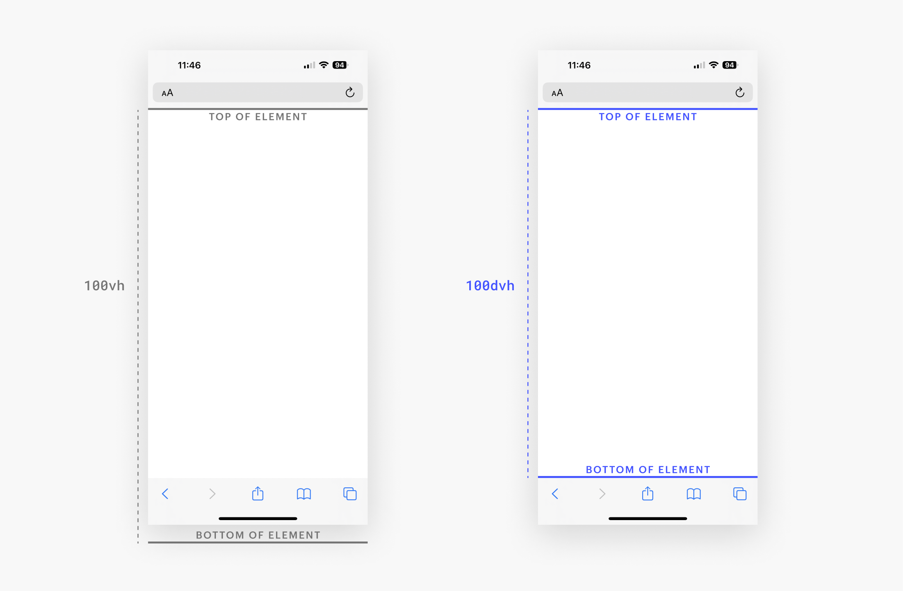

# vh lvh svh dvh介绍

## 1. 出现背景

假设您有一部具有100px6 屏幕空间的手机。当您加载页面时，浏览器 UI 会占用15px剩下的空间85px用于您的网站内容。

但是，您的浏览器非常酷，因此当您向下滚动时，浏览器 UI 只占用10px，从而使您的网站内容保留为90px。

&lt;div style="height: 100vh"&lt;在您的 Fancy Website™ 上，您的页面上有 5 个元素。当有人第一次加载页面时，每个人&lt;section&gt;都85px很高。但当它们开始向下滚动时，浏览器 UI 开始改变大小，导致这些部分元素增长 5 个像素，总计90px!

现在，假设用户现在位于页面底部，正在查看第五部分元素。他们决定向上滚动，这会产生将浏览器 UI 更改为最大尺寸的副作用。这会导致vh缩小，并且您的部分现在都变5px小了；当您位于页面底部时，共有20px差异（5px每个部分有 4 个部分）。

只需向上滚动一点点，页面内容就会向上跳跃总屏幕空间的 1/5（总共 100 像素/小 20 像素）！这是一次非常不愉快的经历，说实话，这很糟糕。

想象一下，如果您使用了vh诸如 之类的东西font-size，那会是什么样子！

## 2. vh

vh是viewport height的缩写，1vh等于视口高度的1%。

## 3. lvh

lvh是 large viewport height的缩写，大视口百分比单位 (lv*) 是相对于大视口大小定义的：视口大小假设任何动态扩展和缩回的 UA 界面被缩回。
换句话说，就是浏览器UI最小、网站内容最大时的尺寸。

## 4. svh

svh是 small viewport height的缩写，小视口百分比单位 (sv*) 是根据小视口大小定义的：视口大小假定任何 UA 界面都动态展开和缩回以展开。
本质上，它svh为您提供了当浏览器 UI 最大且网站内容最小时可用于填充屏幕的单位。

## 5. dvh

dvh是 dynamic viewport height的缩写，动态视口百分比单位 (dv*) 是根据动态视口大小定义的：动态考虑动态扩展和缩回的任何 UA 界面来调整视口大小。这允许作者调整内容的大小，使其能够完全适合视口，无论是否存在此类界面。
即使视口本身不变，动态视口百分比单位的大小也不稳定。使用这些单位可能会导致内容调整大小，例如在用户滚动页面时。根据使用情况，这可能会干扰用户和/或在性能方面代价高昂。

## 6. 参考

> [Small, large, and dynamic viewport units](https://university.webflow.com/lesson/small-large-and-dynamic-viewport-units?topics=layout-design)
> [CSS: vh, dvh, lvh, svh, and vw units](https://dev.to/frehner/css-vh-dvh-lvh-svh-and-vw-units-27k4#dynamic-viewport-units)
